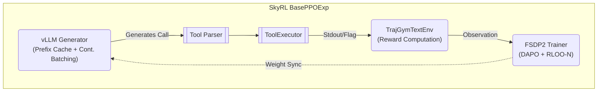
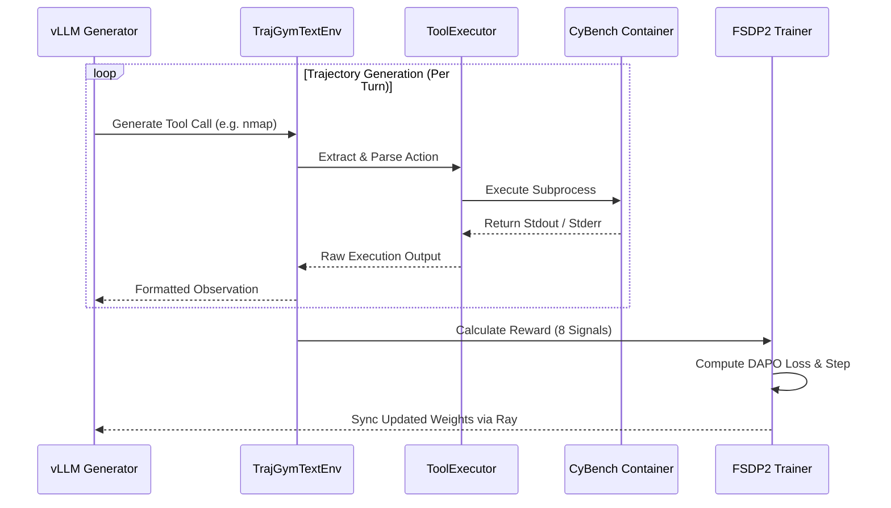
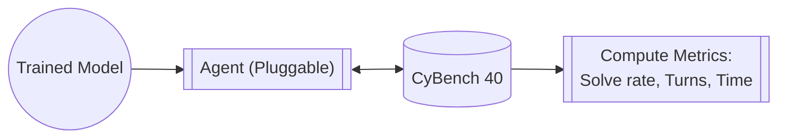

# Architecture

Open Trajectory Gym is a **3-stage post-training pipeline** for fine-tuning LLMs on CTF challenge trajectories using [TRL](https://github.com/huggingface/trl) (SFT), [SkyRL](https://github.com/westonbrown/SkyRL/tree/open-ctf/v0.3.1-patched) (online RL), and [GEPA](https://arxiv.org/abs/2507.19457) (prompt evolution).

## System Overview

```mermaid
flowchart TD
    %% Node Definitions
    Traces[/"Raw Agent Traces"/]
    Synth[/"Synthetic Data"/]
    Convert[["Converter & Splitter"]]
    
    SFTData[("SFT Dataset")]
    RLData[("Online RL Dataset")]
    
    SFT("Stage 1: SFT (TRL)")
    Merge[["Merge LoRA"]]
    Online RL("Stage 2: Online RL (RLOO/DAPO) (SkyRL)")
    GEPA("Stage 3: GEPA (DSPy)")
    
    Model(("Final CTF Agent"))
    Eval{{"CyBench Evaluation"}}

    %% Data Flow
    Traces --> Convert
    Convert -->|"Successes"| SFTData
    Convert -->|"All + Flags"| RLData
    Synth -.-> SFTData & RLData

    %% Training Flow
    SFTData --> SFT
    SFT --> Merge
    Merge --> Online RL
    RLData --> Online RL
    Online RL --> GEPA
    
    %% Output
    GEPA --> Model
    Model --> Eval
```

## Module Structure

```
src/trajgym/
├── agent/
│   ├── protocol.py              # StepAgent + Agent protocols, AgentResult, validate_step_agent
│   ├── default_agent.py         # DefaultStepAgent — default Online RL tool parser + executor
│   ├── framework_runtime_bridge.py  # BYO adapter bridge (tool_calls + native mode)
│   ├── wire_protocol.py         # JSON wire protocol v1.0 for BYO subprocess agents
│   └── rollout_status.py        # RolloutStatus enum (replaces stringly-typed values)
├── integrations/
│   ├── boxpwnr_adapter.py      # Agent adapter for BoxPwnr (optional, lazy-imported)
│   └── boxpwnr_runner.py       # BoxPwnr Solver wrapper (optional, lazy-imported)
├── challenges/
│   ├── registry.py              # ChallengeRegistry — YAML-backed challenge lookup
│   └── manager.py               # ChallengeManager — Docker container lifecycle
├── cli/
│   ├── train.py                 # trajgym-train (sft, rl, gepa, merge)
│   ├── convert_traces.py        # trajgym-convert
│   ├── split_dataset.py         # trajgym-split
│   ├── evaluate.py              # trajgym-eval (--agent for pluggable agents)
│   ├── challenges.py            # trajgym-challenges (setup/status/teardown)
│   ├── validate_pipeline.py     # trajgym-validate
│   └── export_gguf.py           # trajgym-export
├── data/
│   ├── converter.py             # Agent trace → ChatML conversion (default: BoxPwnr format)
│   ├── preprocessor.py          # SFT data preprocessing (packing, truncation)
│   └── splitter.py              # SFT/Online RL dataset splitting
├── envs/
│   ├── tool_executor.py         # SubprocessExecutor + RemoteBatchExecutor
│   └── skyrl/
│       └── trajgym_env.py       # TrajGymTextEnv (SkyRL BaseTextEnv subclass)
├── synthetic_data_generation/   # Offline synthetic trace generation
│   ├── manifest.py              # WorldManifest dataclass — loads YAML configs defining hosts, files, services, tool responses
│   ├── executor.py              # SimulatedEnvironmentExecutor — mocks all 13 agent tools using manifest data
│   └── generator.py             # LiteLLMAgentAdapter + SyntheticGenerator — runs teacher LLM in ReAct loop, exports traces
├── formatters/
│   ├── base.py                  # ModelFormatter abstract base + auto-detection
│   ├── qwen3.py                 # ChatML + Hermes tool format
│   ├── glm4.py                  # GLM-4.7 observation role + MoE tool format
│   └── devstral.py              # Mistral INST tags + strict alternation
├── rewards/
│   └── reward.py                # Reward (8 signals + hallucination penalty)
└── training/
    ├── sft/
    │   └── trl.py               # TRL SFT backend
    ├── online_rl/
    │   ├── runtime.py           # SkyRL runtime + config conversion
    │   ├── step_reward.py       # Per-step shaping reward adapter
    │   └── trajectory_logger.py # Rollout + reward telemetry
    └── gepa.py                  # GEPA prompt optimizer (DSPy + AgentDSPyAdapter)

configs/
├── challenges/
│   └── cybench.yaml             # 40 CyBench challenges (25 docker + 15 static)

examples/
├── qwen35-27b/                  # Qwen3.5-27B training + eval configs
├── qwen35-9b/                   # Qwen3.5-9B training config
├── qwen35-4b/                   # Qwen3.5-4B training config
├── devstral-24b/                # Devstral-24B training config
├── bring-your-own/agent/        # BYO agent adapter templates
└── gepa/                        # GEPA prompt optimization examples
```

## Training Data Flow

```mermaid
flowchart LR
    %% Definitions
    Traces[/"Raw Traces"/]
    Synth[/"Synthetic Gens"/]
    Converter[["TraceConverter"]]
    Splitter[["DatasetSplitter"]]
    
    SFT_DB[("sft.jsonl")]
    RL_DB[("online_rl.jsonl")]

    SFT("SFT Stage")
    Merge[["PEFT Merge"]]
    Online RL("Online RL Stage")
    GEPA("GEPA Stage")
    Model(("Final Export"))

    %% Flow
    Traces --> Converter --> Splitter
    Splitter -- "Successes" --> SFT_DB
    Splitter -- "All + Flags" --> RL_DB
    Synth -.-> SFT_DB & RL_DB

    SFT_DB --> SFT --> Merge --> Online RL
    RL_DB --> Online RL
    Online RL --> GEPA --> Model
```

## CTF Reward Function

The reward function (`src/trajgym/rewards/reward.py`) uses a flag-dominant configuration for stable RLOO gradient signal:

### Active Signals

| Signal | Weight | What It Measures |
|--------|--------|------------------|
| **Flag Capture** | 0.85 | Correct flag submission / terminal solve |
| **Efficiency** | 0.10 | Physics-inspired: `step_ratio × action_novelty × temporal_decay` |
| **Format Compliance** | 0.05 | Valid, parseable tool-call structure |

### Available but Zeroed (reactivate via config weights)

| Signal | Why Zeroed |
|--------|-----------|
| Recovery | Correlated with flag capture (redundant signal) |
| Progression | Correlated with flag capture (redundant signal) |
| Cognitive | Rewards command loops (words-per-action metric) |
| Exploration | Subsumed by efficiency's action_novelty component |
| Uniqueness | Subsumed by efficiency's action_novelty component |
| Hallucination | Caused false penalties on silent flag drops |

All 8 signals exist in `reward.py` and can be reactivated by setting non-zero weights in the training config. Recommended to reintroduce process signals when flag capture rate exceeds 10% on hard challenges.

## Model Formatters

Each model family has a formatter that handles chat template differences:

| Formatter | Models | Template | Tool Format |
|-----------|--------|----------|-------------|
| `Qwen3Formatter` | Nanbeige4.1-3B, Qwen3 | ChatML (`<\|im_start\|>`) | Hermes (`<tool_call>`) |
| `GLM4Formatter` | GLM-4.7-Flash | GLM4 (observation role) | GLM4MOE (XML function calls) |
| `DevstralFormatter` | Devstral-Small-2-24B | Mistral (`[INST]`) | Mistral tool format |

`ModelFormatter.from_model_id()` auto-detects the appropriate formatter from the model name.

## Online RL Architecture (Stage 2: Online RL)

### Why BaseTextEnv, Not SkyRL-Agent

We deliberately use `skyrl-gym`'s low-level `BaseTextEnv` interface rather than the higher-level `skyrl-agent` framework (`AutoAgentRunner`, `ReActAgent`). The reasons:

1. **13 CTF tools** don't exist in `skyrl-agent`'s `TOOL_REGISTRY` — wrapping our `SubprocessExecutor` inside their tool class hierarchy would add an unnecessary abstraction layer.
2. **Token format parity**: Tool schemas in the Online RL system prompt must exactly match what the model saw during SFT (verified by `test_tokenizer_drift`). SkyRL-Agent's own prompt construction would break this.
3. **Multi-signal reward**: SkyRL-Agent's verifiers are binary pass/fail. Our `Reward` computes 8 continuous process signals.
4. **Per-challenge routing**: CTF challenges require Docker container lifecycle management and per-challenge target URLs — not supported by SkyRL-Agent's task abstraction.

### SkyRL Integration



### Execution Sequence

To keep Online RL scalable, environments operate autonomously and execute commands directly as subprocesses, bypassing the HTTP bottleneck. The training iteration loops are securely coordinated between the model generators and physical containers.



- **Generator** (Ray actor): vLLM inference engine produces N completions per prompt (configured via `n_samples_per_prompt`).
- **Environment** (`TrajGymTextEnv`): Each generation gets its own env instance with a `SubprocessExecutor` for tool execution. No HTTP server — direct subprocess calls.
- **Trainer** (Ray actor): FSDP2 computes DAPO loss with config-driven advantage estimation (for example RLOO or RLOO-N).
- **Placement**: Current Qwen3.5 2x B200 baseline uses `run_engines_locally: true` + `colocate_all: false` (trainer and vLLM on separate GPUs).

### Tool Execution

13 tools shared across training data, reward function, and the ToolExecutor:

| Tier | Tools | Description |
|------|-------|-------------|
| **Execution** | `shell_command`, `exec_command`, `write_stdin`, `python_code`, `execute_command` | Shell scripts, interactive PTY sessions, Python exploits |
| **File Ops** | `read_file`, `grep`, `file_search`, `apply_patch` | Read, search, modify files in the container |
| **Meta** | `flag_found`, `web_search`, `list_sessions`, `close_session` | Flag submission, web search, session management |

## Configuration Architecture

### Per-Framework Configs

```
examples/<model>/training.yaml          ← TRL SFT (native YAML format)
src/trajgym/training/online_rl_templates/<model>.yaml ← SkyRL Online RL base template (native YAML format)
configs/challenges/<benchmark>.yaml     ← Challenge registry (custom YAML)
```

TRL and SkyRL configs use each framework's native format directly — no translation layer.

### Key Settings (Qwen3.5-27B, 48K Context)

| Parameter | SFT | Online RL |
|-----------|-----|------|
| Context length | 32768 (`cutoff_len`) | 32768 (`max_prompt_length`) |
| Max completion | N/A | 8192 (`max_generate_length`) |
| LoRA rank | 64 | 64 |
| LoRA targets | Attention + shared expert only | Same |
| Learning rate | 2e-4 | 5e-6 |
| Epochs | 5 | 1 |
| Batch size | 1 (MoE routing NaN fix) | 1 |
| Loss | Cross-entropy | DAPO |
| Packing | Yes (3x throughput) | N/A |
| Samples per prompt | N/A | 8 |
| Max tool turns | N/A | 50 |
| Trainer strategy | Single GPU / DeepSpeed | FSDP2 + Ray |
| Advantage estimator | N/A | RLOO / RLOO-N (config-dependent) |

## Container Strategy

Two Docker targets from a single multi-stage Dockerfile, separated to avoid dependency conflicts:

| Target | Base | Purpose |
|--------|------|---------|
| `sft` | `nvcr.io/nvidia/pytorch:25.11-py3` | TRL SFT + merge + validate + export |
| `online_rl` | `nvcr.io/nvidia/pytorch:25.11-py3` | SkyRL Online RL + Ray + vLLM |

```bash
docker build -t trajgym:sft  --target sft  -f docker/Dockerfile .
docker build -t trajgym:sft-trl --target sft-trl -f docker/Dockerfile .
docker build -t trajgym:online_rl --target online_rl -f docker/Dockerfile .
```

## Evaluation Pipeline


Evaluation uses any agent implementing the `Agent` protocol. The only variable is model weights — architecture, tools, and evaluation harness are held constant. Use `--agent boxpwnr` (default example) or `--agent custom:module.Class` to plug in your own agent.

## Deployment

### Export Pipeline

```bash
# Merge LoRA + convert to GGUF + quantize (one command)
trajgym-export \
    --adapter outputs/online_rl/final \
    --base-model Nanbeige/Nanbeige4.1-3B \
    --output models/ctf-agent-Q4_K_M.gguf \
    --quant Q4_K_M

# Merge only (for vLLM serving)
trajgym-train merge \
    --adapter outputs/online_rl/final \
    --base-model Nanbeige/Nanbeige4.1-3B \
    --output outputs/merged
```

### Serving Options

| Option | Best For | Format | Command |
|--------|----------|--------|---------|
| **Ollama** | Local dev (3B-30B) | GGUF | `ollama create ctf-agent -f Modelfile` |
| **llama.cpp** | Max context, reasoning | GGUF | `llama-server -m model.gguf --jinja -c 32768` |
| **vLLM** | Production (24B+) | Safetensors | `vllm serve outputs/merged --enable-auto-tool-choice` |
| **Docker** | CI / cloud | Either | `docker compose run --rm export` |

**vLLM tool call parser by model family:**

| Model Family | vLLM Parser | Notes |
|-------------|-------------|-------|
| **Qwen3.5** | `qwen3_coder` | Also requires `--reasoning-parser qwen3 --language-model-only --enforce-eager` |
| Nanbeige4.1-3B, Qwen3 | `hermes` | Hermes tool format (ChatML) |
| GLM-4.7-Flash | `glm47` | GLM4 XML tool format |
| Devstral/Mistral | `mistral` | Mistral tool format |

**Running the agent against a served model:**

```bash
OPENAI_API_BASE=http://localhost:8000/v1 \
trajgym-agent \
    --platform cybench \
    --target "[Easy] TimeKORP" \
    --model openai/ctf-agent \
    --max-turns 30
```

### Quantization

| Quant | Bits/Weight | Quality | Use Case |
|-------|-------------|---------|----------|
| F16 | 16 | Best | Evaluation |
| Q8_0 | 8 | Excellent | Development |
| **Q4_K_M** | **4** | **Good** | **Recommended** |
| Q3_K_M | 3 | Acceptable | VRAM-limited |

| Base Model | Params | F16 | Q4_K_M | VRAM (Q4) |
|-----------|--------|-----|--------|-----------|
| **Qwen3.5-27B** | 27B | 54GB | 16GB | ~20GB |
| Nanbeige4.1-3B | 3B | 6GB | 2GB | ~4GB |
| Devstral Small 2 | 24B | 48GB | 14GB | ~18GB |
| GLM-4.7-Flash | 30B MoE | 60GB | 18GB | ~22GB |

### Troubleshooting

- **vLLM tool call errors**: Add the correct `--tool-call-parser` for your model family (see table above).
- **Ollama context too short**: Create a Modelfile with explicit `PARAMETER num_ctx 32768`.
- **GGUF conversion fails**: Ensure the merged model has `config.json`, `model*.safetensors`, `tokenizer.json`, `tokenizer_config.json`.
- **GPU compute capability**: Some GPUs (e.g., GB10 sm_121a) may not be supported by all vLLM versions — use llama.cpp or Ollama instead.

## Key Design Decisions

### 1. TRL for SFT

**Problem**: Fine-tuning across different LLM families securely usually requires many custom scripts.

**Solution**: The TRL backend natively supports model-specific configurations uniformly and scales appropriately. No Python code changes per experiment.

### 2. SkyRL for Online RL

**Problem**: Custom Online RL script required 6 monkey-patches for GLM-4.7-Flash MoE on Blackwell GPUs (prefix check, dtype cast, weight sync translation, NCCL segfault, etc.).

**Solution**: SkyRL uses Ray process isolation — vLLM runs in a separate process from training. This removes the old in-repo monkey-patch-heavy Online RL loop. Remaining upstream compatibility fixes are isolated in `docker/patches/`.

### 3. BaseTextEnv Over SkyRL-Agent

**Problem**: SkyRL-Agent's `ReActAgent` and `TOOL_REGISTRY` are designed for SWE-Bench tasks. CTF challenges need 13 custom tools, multi-signal rewards, per-challenge Docker routing, and strict SFT-Online RL token format parity.

**Solution**: Use `skyrl-gym`'s `BaseTextEnv` directly. Tool execution via `SubprocessExecutor`, reward via `Reward`, schemas injected into prompts deterministically. Plugs into SkyRL-Train's `BasePPOExp` without the agent abstraction layer.

### 4. Model-Agnostic YAML Design

**Problem**: Hardcoded model assumptions (MoE batch_size=1, BF16-only, specific template) made it difficult to test new architectures.

**Solution**: All model-specific settings live in YAML configs. To add a model: create `examples/<model>/training.yaml`. No Python code changes.

### 5. MoE-Aware Configuration

MoE models (GLM-4.7-Flash) have unique constraints documented in their config files:
- No 4-bit quantization (BitsAndBytes + MoE routing incompatibility)
- `batch_size=1` (MoE routing NaN with padding tokens)
- `colocate_all: true` for legacy colocated MoE profiles (Qwen3.5/B200 baseline uses non-colocated local engines)
- Router layers excluded from LoRA targets

## Hardware Compatibility

| Hardware | SFT (Dense 3B) | SFT (MoE 30B) | Online RL (Dense 3B) | Online RL (MoE 30B) |
|----------|----------------|----------------|------------------|-----------------|
| 128GB+ unified memory GPU | QLoRA 4-bit | BF16 LoRA | Colocate mode | Colocate mode |
| H200 (141GB) | QLoRA 4-bit | BF16 LoRA | Colocate mode | Zero-offload possible |
| B200 (192GB) | QLoRA 4-bit | BF16 LoRA | Non-colocated local engines | Non-colocated local engines |

## Extension Points

### Adding New Models

1. Create `examples/<model>/training.yaml` with SFT hyperparameters
2. Create `src/trajgym/training/online_rl_templates/<model>.yaml` with Online RL hyperparameters
3. Add a formatter in `src/trajgym/formatters/` if the chat template is non-standard
4. Add detection logic to `formatters/base.py` factory method

### Adding New Reward Signals

1. Add the signal computation to `src/trajgym/rewards/reward.py`
2. Add its weight to the configurable weights dict
3. Ensure weights sum to 1.0

### Adding New Benchmarks

Challenge registries are YAML-driven. To add a new benchmark:
1. Create `configs/challenges/<name>.yaml` with challenge definitions
2. Run `trajgym-challenges setup --registry configs/challenges/<name>.yaml`
3. No changes to training pipeline, reward function, or tool schemas

### Adding Custom Agents (BYO Agent)

Open Trajectory Gym supports two agent protocols depending on the integration point:

1. **StepAgent** (Online RL training): Set `online_rl.agent_class` in your training config to a dotted path to your class. The agent handles tool parsing and execution while SkyRL owns generation.
2. **Agent** (eval/GEPA): Pass `--agent custom:module.MyAgent` to `trajgym-eval` or `trajgym-train gepa`.
3. **Runtime bridge** (external frameworks): Use `TRAJGYM_AGENT_MODE=native` with an adapter script. See `examples/bring-your-own/agent/template_adapter.py`.

For the complete BYO agent guide, see `docs/byo_agent.md`.
