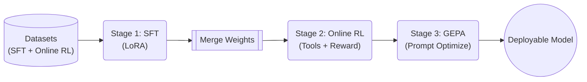

# Training Guide

Open Trajectory Gym uses a **3-stage training pipeline**: SFT (supervised fine-tuning) for knowledge acquisition, online RL (reinforcement learning with live tool execution) for efficiency optimization, and GEPA (prompt evolution) for no-weight-update refinement.

## Pipeline Overview

```mermaid
flowchart LR
    %% Data Flow
    Traces[/"Agent Traces"/] --> Convert[["Convert & Split"]]
    Convert -->|"Successes"| SFTData[("SFT Data")]
    Convert -->|"All + Flags"| RLData[("Online RL Data")]

    %% Train
    SFTData --> SFT("SFT Stage<br/>(TRL)")
    SFT -.->|"LoRA"| Merge[["PEFT Merge"]]
    Merge --> Online RL("Online RL Stage<br/>(SkyRL)")
    RLData --> Online RL
    
    %% Post-train
    Online RL --> GEPA("GEPA Stage<br/>(DSPy)")
    GEPA --> Final(("Final Model"))
```

### High-Level Training Sequence



| Stage | Framework | What It Does | Weight Updates |
|-------|-----------|--------------|----------------|
| **1. SFT** | [TRL](https://github.com/huggingface/trl) | YAML-driven TRL SFT backend for extensive model support (including Qwen3.5). | Yes |
| **2. Online RL** | [SkyRL](https://github.com/westonbrown/SkyRL/tree/open-ctf/v0.3.1-patched) | Online RL with live tool execution via ToolExecutor (subprocess). Ray-based, vLLM, DAPO. | Yes |
| **3. GEPA** | [DSPy](https://github.com/stanfordnlp/dspy) | Prompt evolution via reflection. Pareto-based candidate selection. ~6% better than Online RL with 4-35x fewer rollouts. | No |

## Data Preparation

### 1. Convert Agent Traces

The converter supports traces from any agent that produces multi-turn tool-use conversations. BoxPwnr is the default reference agent, but any trace source following the same format works.

```bash
# Convert successful traces only (recommended for SFT)
trajgym-convert \
    --input targets/ \
    --output data/sft_train.jsonl \
    --success-only --dedup

# Also save failures (useful for Online RL exploration)
trajgym-convert \
    --input targets/ \
    --output data/sft_train.jsonl \
    --output-failure data/failures.jsonl
```

### 2. Split into SFT and Online RL Datasets

```bash
trajgym-split \
    --input data/sft_train.jsonl \
    --sft-output data/sft.jsonl \
    --online-rl-output data/online_rl.jsonl \
    --max-online-rl-tokens 32768
```

### Data Format

**SFT** uses ChatML format:

```json
{
  "messages": [
    {"role": "system", "content": "..."},
    {"role": "user", "content": "Solve: http://target"},
    {"role": "assistant", "content": "...", "tool_calls": [...]},
    {"role": "tool", "tool_call_id": "...", "name": "shell_command", "content": "..."}
  ],
  "metadata": {"source": "agent_name", "platform": "cybench"}
}
```

**Online RL** adds ground truth for reward computation:

```json
{
  "messages": [...],
  "ground_truth_flag": "FLAG{...}",
  "metadata": {"optimal_steps": 12, "vulnerability_type": "idor"}
}
```

## Stage 1: Supervised Fine-Tuning (SFT)

SFT uses the **TRL backend** to teach domain knowledge, tool schemas, and reasoning patterns.

### Quick Start

```bash
trajgym-train sft \
    --model Qwen/Qwen3.5-4B \
    --data data/sft.jsonl \
    --output outputs/sft


```

### Configuration

Model-specific configs live in `examples/`:

| Model | Config | Notes |
|-------|--------|-------|
| **Qwen3.5-27B** | `examples/qwen35-27b/training.yaml` | Production, 27B dense, BF16 |
| **Qwen3.5-9B** | `examples/qwen35-9b/training.yaml` | Mid-tier, 9B dense |
| **Qwen3.5-4B** | `examples/qwen35-4b/training.yaml` | Fast research iteration |
| **Devstral-24B** | `examples/devstral-24b/training.yaml` | Alternative baseline |

Example config (`examples/qwen35-27b/training.yaml`):

```yaml
model:
  name: "Qwen/Qwen3.5-27B"
  max_seq_length: 49152
  load_in_4bit: false
  load_in_8bit: false

lora:
  r: 64
  alpha: 128
  dropout: 0
  target_modules:
    - q_proj
    - k_proj
    - v_proj
    - o_proj
    - gate_proj
    - up_proj
    - down_proj
  use_rslora: false

sft:
  epochs: 3
  batch_size: 1
  gradient_accumulation_steps: 8
  learning_rate: 2.0e-5
  warmup_ratio: 0.03
  weight_decay: 0.01
  lr_scheduler_type: cosine
  packing: false
  flash_attn: true
```

### SFT Key Parameters

| Parameter | Recommended | Notes |
|-----------|-------------|-------|
| `model.max_seq_length` | 49152 | Context window for training (96.8% of data fits 49K) |
| `sft.epochs` | 3 | Research shows short SFT (1-3) can underfit for RL |
| `sft.learning_rate` | 2e-5 | Standard for LoRA SFT |
| `sft.packing` | true | 3x throughput improvement (dense packing into max_seq_length batches) |
| `lora.r` | 64 | Higher rank = more capacity |
| `sft.flash_attn` | true | Falls back to SDPA if flash_attn not available |
| `sft.gradient_checkpointing` | true | Required for long-context training |

### Multi-GPU SFT

For models that exceed single-GPU memory (e.g., Qwen3.5-27B at 49K context), use multi-GPU SFT with `device_map=balanced`:

```bash
CUDA_VISIBLE_DEVICES=0,1 trajgym-train sft \
    --model Qwen/Qwen3.5-27B \
    --data data/sft.jsonl \
    --output outputs/sft-qwen35 \
    --config examples/qwen35-27b/training.yaml \
    --packing
```

Key considerations for multi-GPU SFT:

- `device_map=balanced` shards the base model across GPUs
- `completion_only_loss=True` (TRL 0.29+ native assistant-only masking)
- For very large vocab models (248K+), consider a fused cross-entropy kernel (e.g., Liger) to avoid logits OOM

### Alternative SFT Data Sources

In addition to agent trace conversion, SFT data can be generated synthetically using the offline synthetic data generation pipeline. See `configs/synthetic_data_generation/` for configuration examples covering incident response, lateral movement, and APT emulation scenarios.

## Merging LoRA Adapters

After SFT, merge the LoRA adapter into the base model for Online RL:

```bash
trajgym-train merge \
    --adapter outputs/sft \
    --base-model Qwen/Qwen3.5-4B \
    --output outputs/sft-merged
```

## Stage 2: Online RL (RLOO/DAPO) (Reinforcement Learning)

Online RL uses **SkyRL** to optimize for flag capture efficiency with live tool execution via the **ToolExecutor** (direct subprocess). The model generates tool calls, the ToolExecutor runs them locally (shell, Python, file ops), and the CTF reward function scores the full trajectory. No HTTP server required — SkyRL's per-worker process isolation handles everything.

### Prerequisites

1. **Merged SFT model**: Online RL starts from the SFT checkpoint.
2. **CyBench challenge containers** (optional): For live challenge execution (`trajgym-challenges setup`).

### Quick Start

```bash
trajgym-train rl \
    --model outputs/sft-qwen35-merged \
    --data data/online_rl.jsonl \
    --output outputs/online_rl-qwen35 \
    --config examples/qwen35-27b/training.yaml \
    --challenge-registry configs/challenges/cybench.yaml
```

`trajgym-train rl` now runs `trajgym-validate --mode online-rl-preflight` automatically and requires `<data>.manifest.json` by default. Use `--allow-missing-manifest` only for ad-hoc debugging.

For remote challenge infrastructure (for example challenge containers on one host tunneled to a remote GPU instance), generate a live challenge target map on the challenge host and pass it to Online RL:

```bash
# On the host running challenge containers
PYTHONPATH=src python3 src/trajgym/cli/generate_target_map.py \
    --registry configs/challenges/cybench.yaml \
    --benchmark-root /workspace/cybench \
    --port-offset 10200 \
    --output /tmp/cybench_targets.json

# On the trainer host (remote GPU instance)
TRAJGYM_TARGET_MAP_PATH=/tmp/cybench_targets.json \
trajgym-train rl \
    --model outputs/sft-qwen35-merged \
    --data data/online_rl.jsonl \
    --output outputs/online_rl-qwen35 \
    --config examples/qwen35-27b/training.yaml \
    --challenge-registry configs/challenges/cybench.yaml
```

### Configuration

The Online RL launch profiles in this repo are the `examples/*/training.yaml` files:

| Model | Config | Placement | Notes |
|-------|--------|-----------|-------|
| **Qwen3.5-27B (2x B200 baseline)** | `examples/qwen35-27b/training.yaml` | `run_engines_locally: true`, `colocate_all: false` | Trainer and vLLM on separate GPUs |

Example generated SkyRL topology (from `examples/qwen35-27b/training.yaml`):

```yaml
trainer:
  placement:
    colocate_all: false

generator:
  run_engines_locally: true
  backend: vllm
  n_samples_per_prompt: 2
  max_turns: 60
  sampling_params:
    max_generate_length: 8192

environment:
  env_class: trajgym
```

### Reward Function

The reward function scores completions with a flag-dominant configuration designed for stable RLOO gradients:

| Signal | Weight | Description |
|--------|--------|-------------|
| **Flag Capture** | 0.85 | Exact match (1.0), pattern match (0.1), env-verified (1.0) |
| **Efficiency** | 0.10 | Physics-inspired: `step_ratio × action_novelty × temporal_decay` |
| **Format** | 0.05 | Valid tool call structure and schema compliance |

Additional signals (progression, recovery, cognitive, exploration, uniqueness, hallucination) exist in the reward system but are zeroed for early training. They can be reactivated via config weights once flag capture rate exceeds 10% on hard challenges. See [architecture.md](architecture.md#reward-function) for the full 8-signal system.

### Online RL Key Parameters

| Parameter | Recommended | Notes |
|-----------|-------------|-------|
| `lr` | 5e-6 | Much lower than SFT to avoid instability |
| `n_samples_per_prompt` | 2 (Qwen3.5-27B) | Better wall-clock throughput on dual-B200 while retaining group-relative signal |
| `max_turns` | 60 | Tool-calling iterations per generation for long-horizon trajectories |
| `max_generate_length` | 8192 | Per-turn generation limit |
| `run_engines_locally` + `colocate_all` | `true` + `false` | Working LoRA-safe topology on 2x B200 |
| `advantage_estimator` | `rloo` | Stable with current SkyRL runtime |
| `kl_loss_coef` | 0.0 | No KL penalty (pure DAPO) |

### SkyRL Architecture

SkyRL uses Ray actors for fully async Online RL:

- **Generator**: vLLM inference engine produces completions in a separate process.
- **Trainer**: FSDP2 handles distributed training with gradient checkpointing.
- **Environment**: `TrajGymTextEnv` (in `src/trajgym/envs/skyrl/trajgym_env.py`) bridges SkyRL and the `ToolExecutor` via direct subprocess calls. No HTTP server.
- **Placement**: Current Qwen3.5 production profile uses `run_engines_locally: true` + `colocate_all: false` so trainer and vLLM can be pinned to separate GPUs.

## Stage 3: GEPA (Prompt Evolution)

GEPA optimizes the system prompt without changing model weights. It uses DSPy's reflective agent pattern with Pareto-based candidate selection. Both the agent LM and the reflection LM default to the **same model** — no cloud APIs required. Both can point at a local vLLM server.

### How GEPA Improves Over Time

```
Iteration 1:
  Seed Prompt → Evaluate on minibatch (3 challenges) → Score each [0.8, 0.2, 0.5]
       ↓
  Reflection LM analyzes traces: "Agent found IDOR but never enumerated IDs"
       ↓
  Mutation: "When you discover an ID parameter, enumerate nearby IDs (±20)"
       ↓
  Candidate Prompt v1.1

Iteration 2:
  Evaluate BOTH prompts on next minibatch
  Seed:   [0.3, 0.7, 0.4]
  v1.1:   [0.6, 0.7, 0.8]  ← better on challenges A and C
       ↓
  Pareto Selection: v1.1 dominates seed → seed dropped
       ↓
Iteration 3...N:
  Reflect on v1.1 failures → v1.2, v1.3 → Evaluate → Pareto select → repeat
```

Pareto selection keeps prompts that excel at **different challenges** (non-dominated solutions), avoiding local optima. The final output is the prompt with the best average score.

### Quick Start

```bash
# Default: agent and reflection LM are the same local model
# Set OPENAI_API_BASE=http://localhost:8001/v1 to point at local vLLM
trajgym-train gepa \
    --model openai/ctf-agent \
    --data data/online_rl.jsonl \
    --output outputs/gepa

# Stronger reflection: serve a larger model on a separate port
trajgym-train gepa \
    --model openai/ctf-agent \
    --data data/online_rl.jsonl \
    --output outputs/gepa \
    --reflection-model openai/larger-model

# Custom agent mode: wrap any Agent in a DSPy Module
trajgym-train gepa \
    --model openai/ctf-agent \
    --data data/online_rl.jsonl \
    --output outputs/gepa \
    --agent my_module.MyAgent \
    --challenge-registry configs/challenges/cybench.yaml \
    --budget heavy
```

When `--agent` is set, GEPA wraps the Agent in a `AgentDSPyAdapter` so the DSPy optimizer can evolve the system prompt while the agent handles generation and tool execution.

### CLI Flags

| Flag | Default | Description |
|------|---------|-------------|
| `--model` | (required) | LLM model id for `dspy.LM` (local vLLM recommended) |
| `--data` | (required) | Path to Online RL JSONL data (challenges) |
| `--output` | (required) | Output directory for optimized prompt |
| `--reflection-model` | same as `--model` | LLM for reflection. For stronger mutations, use a larger local model. |
| `--budget` | `medium` | Budget preset: `light`, `medium`, or `heavy` |
| `--agent` | `None` | Dotted path to a Agent class (e.g. `my_module.MyAgent`) |
| `--challenge-registry` | `None` | Path to challenge registry YAML for target URL resolution |
| `--val-data` | `None` | Validation JSONL (separate from train) |
| `--max-samples` | `None` | Max training examples |

### Configuration

GEPA settings live in the `gepa:` section of `training.yaml`:

```yaml
gepa:
  seed_prompt: null              # Override default CTF agent prompt (null = use built-in)
  reflection_model: null         # Reflection LM (null = same as agent model)
  max_iters: 20                  # Max tool-calling iterations per challenge
  reflection_minibatch_size: 3   # Samples per GEPA reflection batch
  seed: 42
  budget: light                  # Budget preset: light / medium / heavy
  num_threads: 1                 # Parallel challenge evaluations (1 = sequential)
```

### Two LMs, Two Roles

| Role | Temperature | Max Tokens | Purpose |
|------|-------------|------------|---------|
| **Agent LM** | 0.7 | 4,096 | Solves CTF challenges (tool calls) |
| **Reflection LM** | 1.0 | 32,000 | Analyzes traces, proposes prompt mutations |

The higher temperature on the reflection LM encourages diverse prompt mutations. Both default to the same model. For better results, serve a larger model for reflection on a separate vLLM port:

```bash
# GPU 0: Agent model (fast, smaller)
vllm serve my-3b-model --port 8001

# GPU 1: Reflection model (smarter, larger)
vllm serve my-27b-model --port 8002
```

Then configure:
```yaml
gepa:
  reflection_model: "openai/my-27b-model"  # points to port 8002
```

GEPA can run in offline mode (stub tools, scores structure) or online mode (real tools, scores flag capture). Online mode uses the same ToolExecutor as Online RL.

## Full Pipeline

```bash
# 1. Convert traces
trajgym-convert --input targets/ --output data/all.jsonl --dedup
trajgym-split --input data/all.jsonl

# 2. SFT
trajgym-train sft --model Qwen/Qwen3.5-4B --data data/sft.jsonl --output outputs/sft

# 3. Merge
trajgym-train merge --adapter outputs/sft --base-model Qwen/Qwen3.5-4B --output outputs/sft-merged

# 4. Online RL
trajgym-train rl --model outputs/sft-merged --data data/online_rl.jsonl --output outputs/online_rl \
    --config examples/qwen35-27b/training.yaml

# 5. GEPA (optional — same model for agent + reflection, no cloud APIs)
trajgym-train gepa --model openai/ctf-agent --data data/online_rl.jsonl --output outputs/gepa

# 6. Export
trajgym-export --adapter outputs/online_rl/final --base-model Qwen/Qwen3.5-4B --output models/ctf-agent.gguf --quant Q4_K_M
```

## Docker Training

```bash
# Stage 1: SFT
docker compose run --rm sft

# Merge LoRA
docker compose run --rm merge

# Stage 2: Online RL (SkyRL image)
docker compose run --rm online_rl

# Validate
docker compose run --rm validate
```

## Monitoring

Training logs to W&B when `report_to: wandb` is set. Set `WANDB_API_KEY` in your environment, or disable:

```yaml
output:
  report_to: none
```

## Hardware Requirements

| Stage | Model | Minimum GPU | Recommended |
|-------|-------|-------------|-------------|
| SFT | Qwen3.5-4B (BF16 LoRA) | 1x 24GB | 1x 80GB |
| SFT | Qwen3.5-27B (BF16 LoRA) | 2x 80GB | 2x 140GB |
| Online RL | Qwen3.5-4B | 1x 128GB+ GPU | 1x H200 (141GB) |
| Online RL | Qwen3.5-27B | 2x 140GB+ GPU | 2x H200/B200 |
| GEPA | Any | No GPU required | — |
